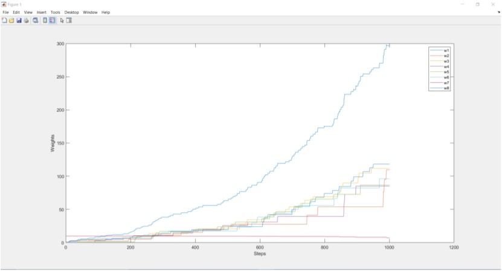

# off-policy-TD
Off policy TD is same as the on policy TD except there is another factor, rho which has to be multiplied in
the update step. The policy vecton consists of the probabilities of choosing the two actions(dot path,
solid path). Pi and b vectors consists of probabilities of moving from one state to another given an
action. The features are a 2D matrix consisiting of the differentiable linear function which describes the
link between the weight matrix and value function. Since there are no terminal states, the loop goes on
only for 1000 time steps directly. The action, corresponding reward, and the next states are calculated
based on the probability given before. The value for the current state and the next state are calculated
which can be used in the update equation. Rho is calculated by dividing the probability for pi and b for
that particular state and action. Once the w is updated, the current state is updated to be the next state
and the whole process repeats for 1000 time steps. The graph for the weights in the weight matrix is
plotted for the first 1000 time steps.

